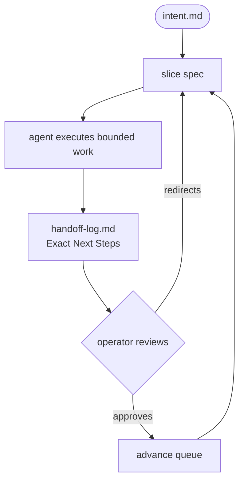

<p align="center">
  
</p>

<p align="center">
  <sub>conductor · structured agent workflow for any project</sub>
</p>

<p align="center">
  
  
  
  
  
  
  
  
</p>

---

## Origins

Conductor as a pattern traces to Google's Gemini CLI extension, released December 17, 2025 by Keith Ballinger, Jay Kornder, and Sherzat Aitbayev. The original design introduced a `conductor/` directory as a filesystem-based context store — tracks with `spec.md`, `plan.md`, and `metadata.json` — and a set of slash commands (`/conductor:newTrack`, `/conductor:implement`, `/conductor:status`) that gave a Gemini agent durable, session-independent context. The filesystem-as-state idea itself traces further back to Anthropic's `CLAUDE.md` convention: put what the agent needs to know in files, not in the model's memory.

This repo extends that foundation:

- **Slice-based execution** replaces the single spec+plan model. Each unit of work is a bounded slice with explicit scope, gates, and out-of-scope declarations.
- **Exact Next Steps** replaces open-ended "next track" proposals. The agent writes a concrete recommendation; the operator approves or redirects. The handoff is the scheduling mechanism.
- **Multi-agent support** — the same scaffold runs with Codex, Claude, and Gemini by renaming `AGENTS.md` to match each CLI's convention.
- **Validation gate** — `scripts/validate.py` enforces Conductor governance with zero external dependencies before any handoff is written. Domain-specific checks live as separate extension scripts — see `demo/scripts/`.
- **Cross-repo tracks** — `conductor/tracks.md` tracks dependencies across repos; spokes coordinate without merging codebases.
- **No external dependencies** — the entire workflow runs from the filesystem. No hosted service, no database, no API calls.

Sources: [Google Developers Blog — Conductor: Introducing context-driven development for Gemini CLI](https://developers.googleblog.com/2025/12/conductor-introducing-context-driven-development-for-gemini-cli/) · [MarkTechPost — Google Releases Conductor](https://www.marktechpost.com/2026/02/02/google-releases-conductor-a-context-driven-ai-development-framework-for-gemini-cli/)

---

# Conductor Workflow

A project-agnostic agent workflow system. Drop the `conductor/` scaffold into any repo, point an AI agent at it, and it will work in a structured, documented, handoff-safe way — regardless of what you're building.

This repo demonstrates the full Conductor loop across three progressive live demos using a LookML + BigQuery data model as the worked example.

---

## Three Demos

| # | Pattern | Branch | Entry | Time |
|---|---|---|---|---|
| 1 | Greenfield bootstrap | `main` | `DEMO.md` | ~5 min |
| 2 | Iterative feature + pair programming | `demo-2-start` | `DEMO2.md` | ~8 min |
| 3 | Automated maintenance | `demo-3-start` | `DEMO3.md` | ~2 min |

Each demo runs independently from its branch — no sequential dependency.

<details>
<summary><strong>Demo 1 — Greenfield Bootstrap</strong></summary>

<br>

`project/` is pre-deployed with a full Conductor instance — index, master plan, slice specs, handoff stub. The agent reads the spine and immediately starts generating LookML. No scaffolding, no meta-work.

**What the agent does:**
1. Reads `project/AGENTS.md` → `project/intent.md` → `project/conductor/index.md` → active slice spec
2. Creates branch `feat/slice-01-lookml-bootstrap`
3. Reads `demo/schema/gold_marts.md` — 8 tables, no live BQ access required
4. Generates 8 `.view.lkml` files, one commit per view
5. Generates `models/gold_marts.model.lkml` with 8 explores
6. Runs `python3 scripts/validate.py` — required gate before handoff
7. Marks slice stable, advances the queue, writes handoff with Exact Next Steps

```bash
git checkout main
# Prompt: "Read DEMO.md and execute it."
```

</details>

<details>
<summary><strong>Demo 2 — Iterative Feature + Pair Programming</strong></summary>

<br>

Project is established (slices 01–03 stable). A new table `fct_promotions` has been provisioned in BigQuery. Two phases — one autonomous, one collaborative.

**Phase 1 — Autonomous execution (~3 min)**
Agent executes `slice-04`: generates the `fct_promotions` view and adds a ninth explore. Writes handoff with Exact Next Steps.

**Phase 2 — Collaborative spec authoring (~5 min)**
Agent reads the Exact Next Steps, drafts `slice-05` (view enrichment), commits the draft, and stops for review. Operator reviews the diff live in the IDE — adjusts scope or wording — then approves. Agent executes.

This is the pair programming pattern: **agent proposes, operator approves, agent executes.** The slice spec is the contract between them.

```bash
git checkout demo-2-start
# Prompt: "Read DEMO2.md and execute it."
```

</details>

<details>
<summary><strong>Demo 3 — Automated Maintenance</strong></summary>

<br>

Simulates a nightly cron job. No human present. The agent wakes up cold with zero session context, orients entirely from the Conductor spine, runs the validator, checks for open blockers, and writes a structured maintenance report.

Status is `clean` (0 failures, 0 blockers) or `degraded` (anything else). Read-and-report only — no auto-fixes. Commits and exits.

This demonstrates that a well-formed Conductor spine is **self-describing** — any agent, any time, can orient from it alone.

```bash
git checkout demo-3-start
# Prompt: "Read DEMO3.md and execute it."
```

</details>

---

## The Conductor Loop



Every agent session does three things:

- **Read** — orient from the spine (`intent.md`, `conductor/index.md`, active slice spec)
- **Execute** — bounded work defined by the slice, committed as it goes
- **Hand off** — write a `handoff-log.md` entry with current state and Exact Next Steps

No state lives in the agent's memory. Everything the next session needs is in the files. The handoff's **Exact Next Steps** field is the scheduling mechanism — the agent proposes what comes next, the operator approves or redirects.

→ Full pattern: [`conductor/README.md`](./conductor/README.md)

---

## Conductor Scaffold

The `conductor/` directory is a reusable, domain-agnostic scaffold. To deploy: copy `conductor/`, `intent.md`, `AGENTS.md`, and `scripts/validate.py` into your repo. The `demo/` and `project/` directories are demo artifacts — do not copy them.

<details>
<summary><strong>Repo structure</strong></summary>

<br>

```
conductor/
  index.md                       ← agent routing — Active slice: + queue table
  master-plan-template.md        ← project scope, phases, architecture decisions
  slice-01-initial-bootstrap.md  ← generic first-slice template
  handoff-log.md                 ← current-state handoff only
  handoff-archive.md             ← older entries archived here
  tracks.md                      ← cross-repo dependencies (stub)
  README.md                      ← full workflow pattern documentation
  AGENTS.md                      ← agent behavioral rules
  CONDUCTOR_MODES.md             ← Patch / Slice / Full Conductor / Audit
  AGENT_PROMPT.md                ← starter prompt for any agent CLI
intent.md                        ← fill this in first (scaffold template — your project goal + stack)
AGENTS.md                        ← root agent rules
scripts/
  validate.py                    ← Conductor spine validator (stdlib only)
demo/
  schema/                        ← authoritative schema reference (no live BQ needed)
  views/                         ← reference LookML output
  models/                        ← reference model output

project/                         ← demo instance only, not part of the scaffold
  intent.md                      ← demo-specific intent the agent reads during the demo
```

> Two `intent.md` files exist in this repo. `intent.md` at root is the scaffold template you replace with your own project's goal and stack. `project/intent.md` is the pre-deployed demo instance the agent works from. In your own repo there will be only one.

</details>

<details>
<summary><strong>Adapting for your project</strong></summary>

<br>

**First 10 minutes:**

1. Copy `conductor/` into your repo
2. Fill in `intent.md` — three things: what you're building, your stack, and what "done" looks like for the first slice. Two paragraphs is enough. The agent reads this every session to stay grounded.
3. Edit `conductor/slice-01-initial-bootstrap.md` — replace the objective, steps, and acceptance criteria with your first slice. Keep it small: one feature, one file set, completable in a single agent session. The handoff format, queue, and archive pattern stay as-is.
4. Rename `AGENTS.md` → `CLAUDE.md` or `GEMINI.md` to match your CLI (or leave as `AGENTS.md` for Codex). Do the same inside `conductor/`.
5. Run `python3 scripts/validate.py` — it checks the spine before any agent runs. Fix any warnings.
6. Point an agent at the repo root: `"Read AGENTS.md and execute the active slice."`

First agent run → first commit → first handoff: under an hour for most projects. After that the loop self-schedules — the agent's Exact Next Steps guide the next slice, the operator approves or redirects, repeat.

</details>

<details>
<summary><strong>Agent CLI name swap</strong></summary>

<br>

`AGENTS.md` is the canonical name used here. Rename or copy to match your CLI:

| CLI | Reads automatically |
|---|---|
| Codex (OpenAI) | `AGENTS.md` |
| Claude Code | `CLAUDE.md` |
| Gemini CLI | `GEMINI.md` |

Apply the same rename inside `conductor/` — `conductor/AGENTS.md` → `conductor/CLAUDE.md` etc. Gemini CLI walks the directory tree loading every `GEMINI.md` it finds, so the rename in `conductor/` matters.

</details>

---

## Validator

`scripts/validate.py` checks the Conductor spine — domain-agnostic, stdlib only, CI-safe. Checks: spine structure, handoff format (`Commit:`, `Exact Next Steps`), active slice acceptance criteria, CI stub, git branch state.

```bash
python3 scripts/validate.py
```

Domain-specific checks (LookML, dbt, etc.) live as separate extension scripts. See [`demo/scripts/`](./demo/scripts/) for the pattern and a LookML reference implementation.

---

## License

MIT — see [LICENSE](./LICENSE)
